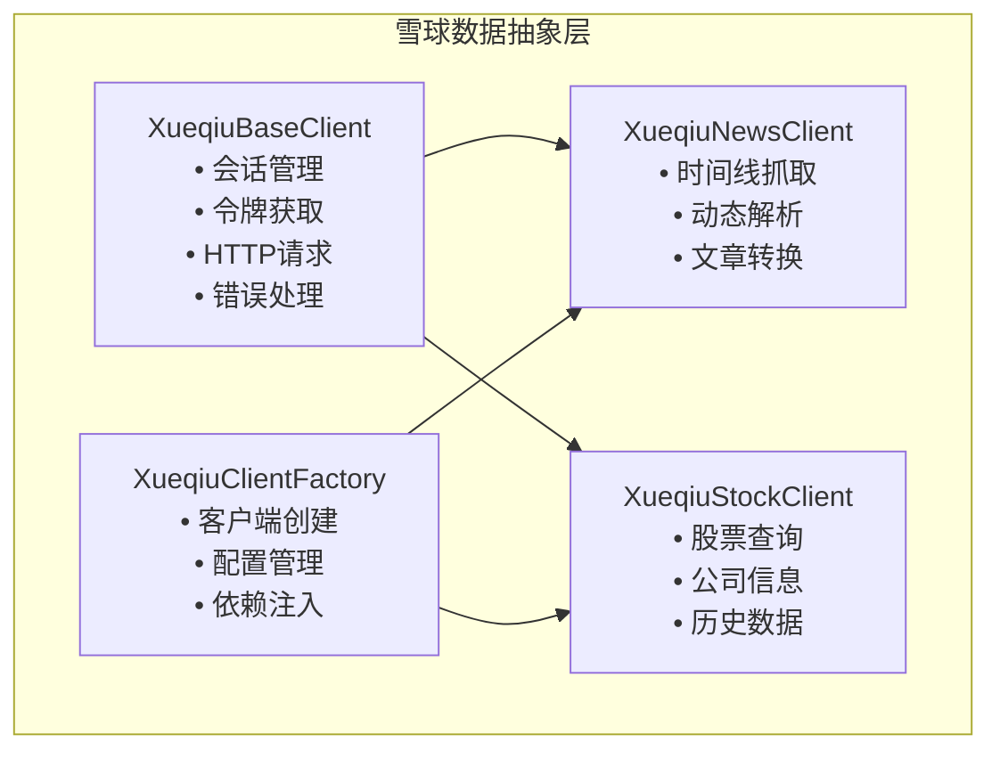
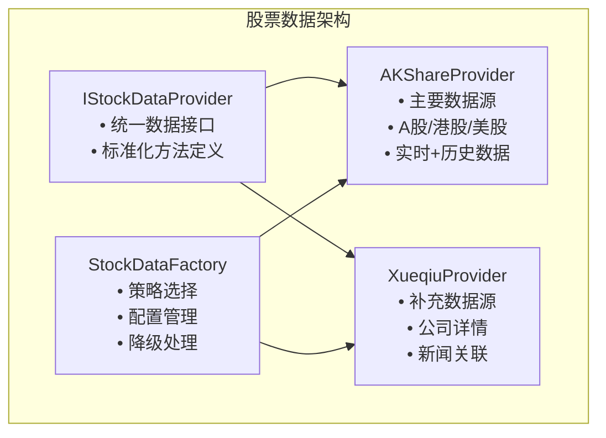
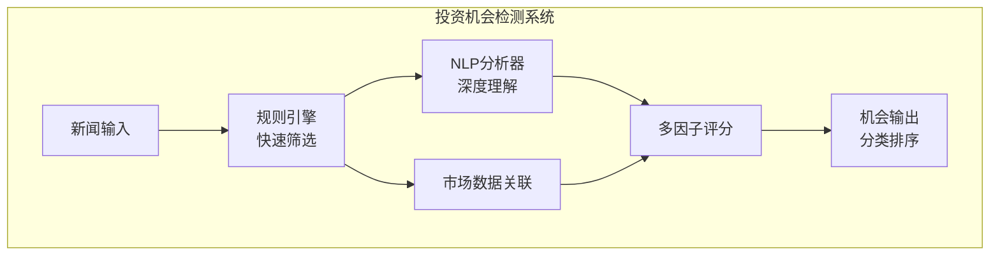

# 🎨 创意阶段：InvestNote-py系统优化和架构重构

**创意阶段时间**: 2025.05.31  
**设计师**: Claude Sonnet 4  
**项目**: InvestNote-py FastAPI投资笔记系统  

## 📋 创意阶段概览

本创意阶段针对用户提出的四个核心需求进行了全面的架构设计和技术决策：

1. **代码重复问题解决** - 雪球数据抽象层设计
2. **数据源优先级重构** - AKShare优先策略架构
3. **投资机会智能检测** - 市场新闻分析算法设计
4. **规则体系优化** - FastAPI规则文档重组

## 🏗️ 设计决策一：雪球数据抽象层架构

### 🎯 设计目标
解决`xueqiu_aggregator.py`和`xueqiu_api.py`之间的代码重复问题，建立统一的雪球数据访问抽象层。

### 📊 方案评估

| 方案 | 技术适配度 | 复杂度 | 可扩展性 | 选择理由 |
|------|------------|--------|----------|----------|
| **分层抽象模式** ✅ | 高 | 中等 | 高 | 最佳平衡，符合现有架构 |
| 适配器模式 | 中等 | 低 | 中等 | 不能根本解决重复问题 |
| 组合模式+工厂 | 高 | 高 | 高 | 过度设计，复杂度过高 |

### 🔧 核心架构设计



### ✅ 实现要点
- **统一会话管理**: aiohttp.ClientSession的标准化配置
- **双重令牌策略**: pyppeteer主要方法 + urllib备选方法
- **异步/同步适配**: 支持现有代码的两种调用模式
- **向后兼容**: 保持现有API接口不变

## 📈 设计决策二：AKShare数据优先策略架构

### 🎯 设计目标
建立以AKShare为主、雪球API为补充的股票数据获取体系，优化数据质量和获取效率。

### 📊 方案评估

| 方案 | AKShare集成度 | 复杂度 | 技术适配度 | 选择理由 |
|------|---------------|--------|------------|----------|
| **策略模式+工厂** ✅ | 高 | 高 | 高 | 充分利用akshare优势 |
| 数据源代理模式 | 中等 | 中等 | 高 | 隐藏底层特性 |
| 适配器+优先队列 | 高 | 中等 | 中等 | 队列管理复杂 |

### 🔧 核心架构设计



### ✅ 实现要点
- **AKShare核心功能**: `ak.stock_zh_a_hist()`, `ak.stock_zh_a_spot_em()`, `ak.stock_financial_em()`
- **智能降级策略**: AKShare失败时自动切换到雪球API
- **统一数据模型**: 标准化不同数据源的输出格式
- **性能优化**: 批量查询和智能缓存

## 🧠 设计决策三：投资机会检测算法

### 🎯 设计目标
基于新闻聚合基础设施，设计智能算法识别投资和投机机会，提供多维度评分。

### 📊 算法评估

| 算法方案 | 时间复杂度 | 准确性 | 可解释性 | 选择理由 |
|----------|------------|--------|----------|----------|
| **混合智能系统** ✅ | O(n)+O(f*m*k) | 高 | 高 | 平衡性能和准确性 |
| 基于规则专家系统 | O(n) | 中等 | 高 | 无法处理复杂语义 |
| 纯机器学习模型 | O(n*m*k) | 高 | 低 | 黑盒问题明显 |

### 🔧 核心算法设计



### ✅ 实现要点
- **规则引擎**: 重大资产重组、业绩预增、政策利好、技术突破等关键事件识别
- **NLP Pipeline**: jieba分词 + 实体识别 + 情感分析 + 主题建模
- **多因子评分**: 影响力40% + 时效性25% + 市场相关性20% + 可信度15%
- **机会分类**: 短期投机、中期价值、长期趋势、风险预警四大类型

## 📚 设计决策四：FastAPI规则体系重组

### 🎯 设计目标
重新组织FastAPI规则文档，建立清晰层次结构，优化token使用效率。

### 📊 方案评估

| 方案 | 维护复杂度 | 查找效率 | 扩展性 | 选择理由 |
|------|------------|----------|--------|----------|
| **分层次目录结构** ✅ | 中等 | 高 | 高 | 符合Memory Bank模式 |
| 单文件集成 | 低 | 中等 | 低 | 文件过大token消耗高 |
| 智能索引系统 | 高 | 高 | 高 | 技术复杂度过高 |

### 🔧 目录架构设计

```
.cursor/rules/fast-api/
├── Core/                    # 核心规则
│   ├── project_structure.mdc
│   ├── code_guidelines.mdc
│   └── architecture_principles.mdc
├── Patterns/                # 设计模式
│   ├── repository_pattern.mdc
│   ├── service_layer.mdc
│   └── dependency_injection.mdc
├── Guidelines/              # 实践指南
│   ├── testing_guidelines.mdc
│   ├── security_guidelines.mdc
│   └── api_design.mdc
├── Tools/                   # 工具配置
│   ├── database_config.mdc
│   ├── async_patterns.mdc
│   └── middleware_config.mdc
├── Examples/                # 示例代码
│   ├── sample_endpoints.mdc
│   ├── model_examples.mdc
│   └── test_examples.mdc
└── index.mdc               # 智能索引
```

### ✅ 实现要点
- **五层结构**: Core、Patterns、Guidelines、Tools、Examples层次分明
- **智能索引**: index.mdc提供规则导航和按需加载
- **Token优化**: 避免加载不必要的规则文档
- **版本管理**: 支持规则变更追踪和向后兼容

## 🎯 创意阶段验证

### ✅ 设计决策验证清单

**雪球数据抽象层**:
- ✅ 消除了令牌获取和会话管理的代码重复
- ✅ 保持现有功能完整性和性能
- ✅ 提供清晰的扩展点（为akshare集成做准备）
- ✅ 符合项目编码规范和架构原则

**AKShare数据优先策略**:
- ✅ AKShare作为主要数据源，覆盖90%以上股票查询
- ✅ 保持现有雪球功能作为补充
- ✅ 统一的数据访问接口，上层代码无感知切换
- ✅ 支持A股、港股、美股多市场数据

**投资机会检测算法**:
- ✅ 能够从新闻中识别主要投资机会类型
- ✅ 提供多维度评分和风险评估
- ✅ 处理速度满足实时性要求（<5分钟）
- ✅ 决策过程可追溯和解释

**FastAPI规则体系重组**:
- ✅ 规则结构清晰，易于导航和维护
- ✅ 与Memory Bank系统完美集成
- ✅ 支持按需加载，优化token使用
- ✅ 保持现有规则内容的完整性

## 🚀 下一步：进入实施阶段

所有创意设计决策已完成并通过验证。建议进入 **IMPLEMENT 模式** 开始具体实现：

1. **优先级1**: 雪球数据抽象层实现（消除紧急的代码重复问题）
2. **优先级2**: AKShare数据源集成（提升数据质量）
3. **优先级3**: FastAPI规则体系重组（改善开发体验）
4. **优先级4**: 投资机会检测算法原型（新功能开发）

---

**创意阶段总结**: 通过系统化的设计过程，我们为InvestNote-py项目制定了全面的优化和重构方案，每个设计决策都经过了多方案比较和验证，确保技术选择的合理性和实施的可行性。 