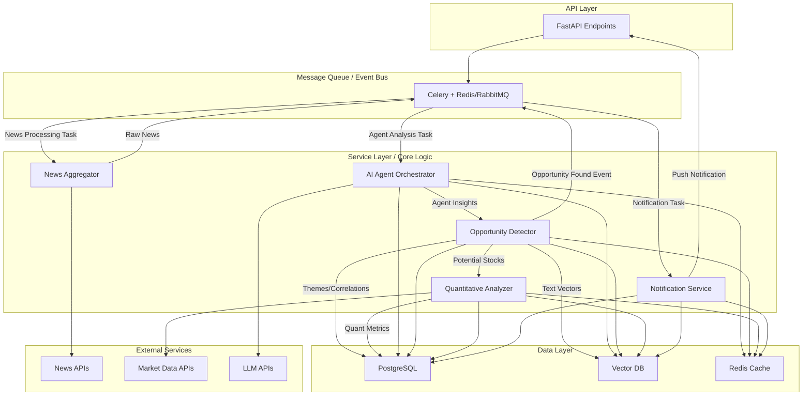

# InvestNote-py 系统模式

## 架构模式

### 事件驱动架构 (EDA) 与分层架构结合

项目在保持传统分层架构（API层、服务层、数据层）的基础上，将引入事件驱动模式来处理核心的新闻分析流程，以实现模块间的松耦合和高可扩展性。

**核心流程**：
1.  **新闻获取**：`News Aggregator` 定时从外部 `News APIs` 拉取新闻，发布"原始新闻待处理"事件到消息队列 `MQ`。
2.  **AI分析编排**：`AI Agent Orchestrator` 消费新闻，根据配置启动多个AI Agent（调用 `LLM APIs`），分析新闻并产生洞察。
3.  **机会发现**：`Opportunity Detector` 整合Agent洞察，结合 `Vector DB` 进行语义匹配，识别投资主题和关联股票，并将初步结果存入 `PostgreSQL`。
4.  **量化验证**：`Quantitative Analyzer` 对潜在股票进行资金流等量化指标分析（数据来自 `Market Data APIs`），更新 `PostgreSQL`。
5.  **通知推送**：若发现高潜力机会，发布"机会待推送"事件，`Notification Service` 消费后通过API层向用户推送。

### AI Agent 模式 (Agent-Based Architecture)

系统将包含多个专门的AI Agent，每个Agent负责特定的分析任务或视角。这是一种分布式智能的体现。

- **Agent类型**: 例如：行业专家Agent、供应链追踪Agent、地缘政治影响Agent、市场情绪Agent、财务异动Agent等。
- **协同方式**: 可以是并行分析，也可以是链式分析（一个Agent的输出作为另一个Agent的输入）。
- **知识共享**: Agent之间可能需要共享中间结果或访问统一的知识库（如向量数据库中的文本嵌入）。
- **可配置性**: Agent的行为、使用的模型、分析的深度等应可配置。

## 设计模式 (扩展与调整)

### 1. 生产者-消费者模式 (Producer-Consumer)
   - **应用场景**: 新闻聚合器作为生产者产生新闻数据，AI分析Agent、通知服务等作为消费者处理这些数据。
   - **实现**: 通过Celery等消息队列实现。

### 2. 策略模式 (Strategy Pattern)
   - **应用场景**: 
        - 不同的AI Agent可以实现相同的分析接口，但采用不同的分析策略或模型。
        - 不同的量化指标计算方法。
        - 不同的新闻源解析策略。

### 3. 责任链模式 (Chain of Responsibility)
   - **应用场景**: 构建AI Agent的分析流程，新闻数据在Agent链上传递，每个Agent完成一部分分析，然后传递给下一个Agent。

### 4. 适配器模式 (Adapter Pattern)
   - **应用场景**: 
        - 统一不同新闻API的接口。
        - 统一不同LLM API的调用方式。
        - 统一不同市场数据源的接口。

### 5. 观察者模式 (Observer Pattern)
   - **应用场景**: 当新的高潜力投资机会被发现时，通知相关的模块（如推送服务、数据统计模块）。

### 6. 装饰器模式 (Decorator Pattern)
   - **应用场景**: 为Agent的分析方法动态添加如日志记录、性能监控、缓存等功能。

### 7. 模板方法模式 (Template Method)
    - **应用场景**: 定义AI Agent执行分析的骨架流程（如：接收输入 -> 预处理 -> 调用LLM -> 后处理 -> 输出），具体步骤由子类Agent实现。

## 数据模式 (扩展)

### 1. 向量嵌入 (Vector Embeddings)
   - **应用**: 将新闻文本、分析报告、投资主题等转换为向量表示。
   - **存储**: 存储在专门的向量数据库 (如Pinecone, Weaviate) 或支持向量索引的关系型数据库 (如PostgreSQL with pgvector)。
   - **用途**: 实现语义搜索、相似内容推荐、新闻与主题匹配等。

### 2. 知识图谱 (Knowledge Graph - 可选，高级阶段)
   - **应用**: 将新闻中提取的实体（公司、人物、事件）及其关系构建成图谱。
   - **存储**: 图数据库 (如Neo4j) 或关系型数据库模拟。
   - **用途**: 进行更复杂的关联分析、路径发现、影响传递推断。

### 3. 数据湖/仓库 (Data Lake/Warehouse - 可选，大规模阶段)
    - **应用**: 当数据量巨大时，用于存储原始新闻数据、分析中间结果、日志等，支持后续的批量分析和机器学习模型训练。

## NLP与AI特定模式

### 1. RAG (Retrieval Augmented Generation)
   - **应用场景**: 在AI Agent调用LLM进行分析或生成报告时，先从向量数据库或知识图谱中检索相关的上下文信息（如相似新闻、公司背景、历史事件），再将这些信息作为Prompt的一部分提供给LLM，以提高生成内容的准确性和相关性。

### 2. 多Agent协同模式 (Multi-Agent Collaboration)
   - **辩论模式 (Debate)**: 多个Agent对同一问题从不同角度进行分析和辩论，最后综合形成结论。
   - **专家咨询模式 (Expert Consultation)**: 一个主Agent遇到特定领域问题时，调用专门的专家Agent获取意见。
   - **流水线模式 (Pipeline)**: 分析任务被分解为多个阶段，每个阶段由一个或多个Agent负责。

## 并发与异步模式

### 1. 异步I/O (Async I/O)
   - **应用**: 大量使用 `async/await` (FastAPI, aiohttp, httpx) 处理网络请求（调用外部API、数据库操作）、文件读写等，避免阻塞主线程。

### 2. 任务队列 (Task Queues)
   - **应用**: 使用Celery等将耗时的NLP处理、AI分析、数据计算等作为后台任务异步执行，提高系统响应速度和吞吐量。

## 配置模式 (保持)

- **配置对象模式 (Pydantic Settings)**: 统一管理应用配置。
- **环境特定配置**: 支持开发、测试、生产等不同环境的配置。

这些模式的引入将支持系统处理复杂的新闻分析流程，实现AI驱动的智能决策，并保证系统的可扩展性、可维护性和高性能。 