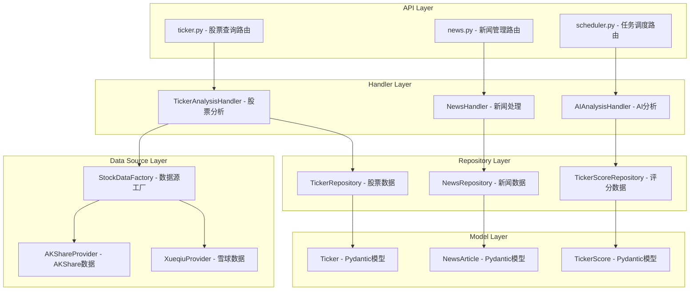
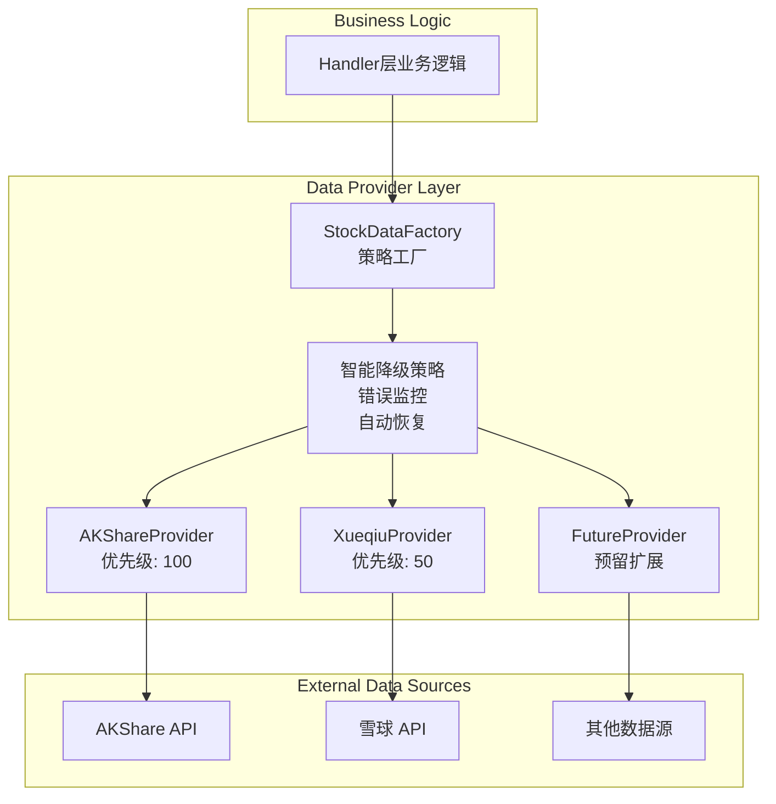
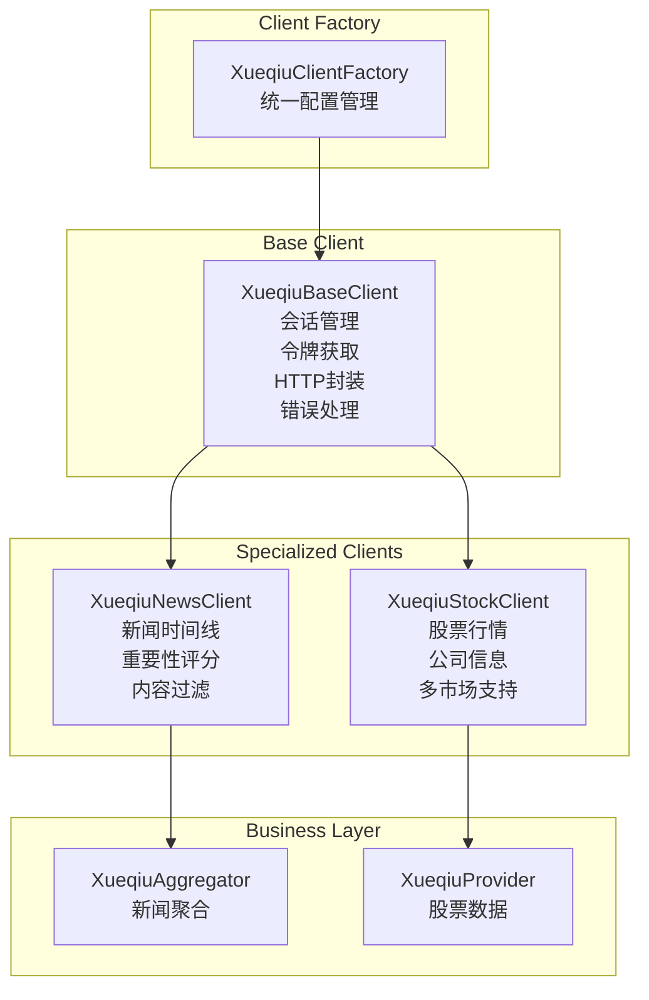
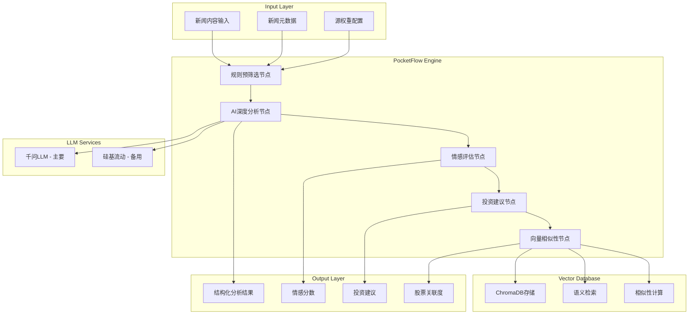

# InvestNote-py 系统模式

## 核心架构模式 (已实现)

### 三层业务架构模式
InvestNote-py 采用经典的三层业务架构，确保职责分离和代码可维护性：



**架构特点**：
1. **职责分离**: 每层只负责特定功能，API层处理HTTP请求，Handler层处理业务逻辑，Repository层处理数据访问
2. **依赖方向**: 单向依赖，上层依赖下层，避免循环依赖
3. **数据流转**: 请求从API层流向Model层，响应反向流转

### 数据提供者模式 (Data Provider Pattern)
统一的数据源访问架构，支持多数据源智能切换：



**核心特性**：
- **统一接口**: 所有数据提供者实现相同的接口
- **智能降级**: 主数据源失败时自动切换备用源
- **错误恢复**: 自动重置错误计数，支持数据源恢复
- **优先级管理**: 基于优先级选择最佳数据源

### 雪球抽象层模式 (Xueqiu Abstraction Pattern)
消除代码重复，提供统一的雪球平台访问接口：



**设计优势**：
- **职责分离**: 新闻客户端和股票客户端各司其职
- **代码复用**: 统一的基础客户端避免重复实现
- **会话管理**: 统一的HTTP会话和令牌管理
- **工厂模式**: 统一的客户端创建和配置

## 核心设计模式 (已实现)

### 1. 策略模式 (Strategy Pattern)
**应用场景**: 数据源选择、评分算法、AI分析策略

```python
# 数据源策略
class StockDataFactory:
    def __init__(self):
        self.providers = [
            AKShareProvider(priority=100),
            XueqiuProvider(priority=50)
        ]
    
    def get_best_provider(self) -> DataProvider:
        # 基于优先级和可用性选择最佳提供者
        return self._select_provider()

# 评分算法策略
class ScoreCalculator:
    def calculate(self, algorithm: str):
        if algorithm == "normal":
            return NormalScore()
        elif algorithm == "trend":
            return TrendScore()
```

### 2. 工厂模式 (Factory Pattern)
**应用场景**: 数据提供者创建、雪球客户端创建、AI工作流创建

```python
# 数据提供者工厂
class StockDataFactory:
    @classmethod
    def create_provider(cls, provider_type: str):
        if provider_type == "akshare":
            return AKShareProvider()
        elif provider_type == "xueqiu":
            return XueqiuProvider()

# 雪球客户端工厂
class XueqiuClientFactory:
    @staticmethod
    def create_news_client() -> XueqiuNewsClient:
        return XueqiuNewsClient(base_client=XueqiuBaseClient())
    
    @staticmethod
    def create_stock_client() -> XueqiuStockClient:
        return XueqiuStockClient(base_client=XueqiuBaseClient())
```

### 3. 适配器模式 (Adapter Pattern)
**应用场景**: 数据库多类型支持、多数据源统一接口

```python
# 数据库适配器
class DbAdapter:
    def __init__(self, db_type: str):
        self.db_type = db_type
    
    def execute(self, sql: str, params: dict):
        # 自动转换占位符格式
        if self.db_type == 'sqlite':
            # 保持 :name 格式
            pass
        else:
            # 转换为 %(name)s 格式
            sql = self._convert_placeholders(sql)

# 数据源适配器
class DataProviderAdapter:
    def __init__(self, provider: DataProvider):
        self.provider = provider
    
    def get_stock_quote(self, code: str) -> StandardQuote:
        # 将不同数据源的响应格式统一为标准格式
        raw_data = self.provider.fetch_data(code)
        return self._normalize_data(raw_data)
```

### 4. 观察者模式 (Observer Pattern)
**应用场景**: 数据更新通知、AI分析完成通知

```python
# 数据更新观察者
class DataUpdateObserver:
    def __init__(self):
        self.observers = []
    
    def notify_data_updated(self, ticker_id: int, data_type: str):
        for observer in self.observers:
            observer.on_data_updated(ticker_id, data_type)

# AI分析观察者
class AIAnalysisObserver:
    def on_analysis_completed(self, article_id: int, analysis_result: dict):
        # 通知相关模块分析完成
        pass
```

### 5. 建造者模式 (Builder Pattern)
**应用场景**: 复杂查询构建、AI工作流构建

```python
# 查询建造者
class TickerQueryBuilder:
    def __init__(self):
        self.conditions = []
        self.order_by = None
        self.limit = None
    
    def where_market(self, market: str):
        self.conditions.append(f"market = '{market}'")
        return self
    
    def where_score_gt(self, score: float):
        self.conditions.append(f"score > {score}")
        return self
    
    def order_by_score(self, desc: bool = True):
        self.order_by = f"score {'DESC' if desc else 'ASC'}"
        return self
    
    def limit_results(self, count: int):
        self.limit = count
        return self
    
    def build(self) -> str:
        sql = "SELECT * FROM ticker"
        if self.conditions:
            sql += " WHERE " + " AND ".join(self.conditions)
        if self.order_by:
            sql += f" ORDER BY {self.order_by}"
        if self.limit:
            sql += f" LIMIT {self.limit}"
        return sql
```

## AI分析模式 (已集成)

### PocketFlow工作流模式
基于100行LLM框架的AI分析流水线：



### 四层分析架构
```
┌─────────────────────────────────────────────────────────────┐
│                规则预筛选层 (Rule Filter)                   │
│  • 关键词过滤    • 来源权重评估                             │
│  • 时效性检查    • 重复内容检测                             │
│  • 质量评分      • 业务相关性判断                           │
└─────────────────────────────────────────────────────────────┘
                             │
┌─────────────────────────────────────────────────────────────┐
│              AI深度分析层 (Deep Analysis)                   │
│  • 事件识别      • 影响链分析                               │
│  • 行业关联      • 因果关系推理                             │
│  • Token优化     • 上下文理解                               │
└─────────────────────────────────────────────────────────────┘
                             │
┌─────────────────────────────────────────────────────────────┐
│              情感评估层 (Sentiment Analysis)                │
│  • 市场情感      • 影响程度评估                             │
│  • 风险等级      • 置信度计算                               │
│  • 紧急程度      • 投资者反应预测                           │
└─────────────────────────────────────────────────────────────┘
                             │
┌─────────────────────────────────────────────────────────────┐
│              投资建议层 (Investment Advice)                 │
│  • 股票关联度    • 短期投资评估                             │
│  • 操作建议      • 风险提示                                 │
│  • 时间窗口      • 预期收益估算                             │
└─────────────────────────────────────────────────────────────┘
```

## 数据模式 (已实现)

### Pydantic模型模式
统一的数据模型架构，保证类型安全和数据一致性：

```python
# 三层模型结构
class TickerBase(BaseModel):
    """基础模型，包含共有字段"""
    code: str = Field(..., description="股票代码")
    name: str = Field(..., description="股票名称")
    # ... 其他字段

class TickerCreate(TickerBase):
    """用于创建的模型"""
    pass

class TickerUpdate(BaseModel):
    """用于更新的模型，所有字段都是可选的"""
    name: Optional[str] = Field(default=None, description="股票名称")
    # ... 其他字段

class Ticker(TickerBase):
    """完整的模型，包含ID和时间戳"""
    id: int = Field(..., description="ID")
    created_at: Optional[datetime] = Field(default_factory=datetime.now)
```

### JSON字段扩展模式
利用JSON字段存储复杂数据，支持灵活的数据结构：

```python
# 股票评分历史数据存储
ticker_score.history = {
    "raw_score": 0.85,
    "z_score": 1.2,
    "trend_strength": 0.7,
    "volume_confirmation": 0.9
}

# 新闻AI分析结果存储
news_article.ai_analysis = {
    "event_type": "财报发布",
    "impact_level": "高",
    "affected_sectors": ["科技", "电信"],
    "stock_correlations": {
        "600000": 0.8,
        "000001": 0.6
    }
}
```

## 异步编程模式 (已实现)

### 异步优先架构
全栈异步设计，最大化并发性能：

```python
# API层异步
@router.get("/ticker/{ticker_id}")
async def get_ticker_analysis(ticker_id: int):
    result = await ticker_handler.analyze_async(ticker_id)
    return result

# Handler层异步
class TickerAnalysisHandler:
    async def analyze_async(self, ticker_id: int):
        # 并发获取多种数据
        ticker_task = self.ticker_repo.get_by_id_async(ticker_id)
        score_task = self.score_repo.get_latest_async(ticker_id)
        news_task = self.news_repo.get_related_async(ticker_id)
        
        ticker, scores, news = await asyncio.gather(
            ticker_task, score_task, news_task
        )
        return self._combine_analysis(ticker, scores, news)
```

### 并发处理模式
```python
# 多数据源并发获取
async def fetch_multiple_markets():
    tasks = [
        akshare_provider.get_market_data_async("A股"),
        akshare_provider.get_market_data_async("港股"),
        akshare_provider.get_market_data_async("美股")
    ]
    results = await asyncio.gather(*tasks, return_exceptions=True)
    return [r for r in results if not isinstance(r, Exception)]

# 批量AI分析
async def batch_analyze_news(articles: List[NewsArticle]):
    analysis_tasks = [
        ai_analyzer.analyze_async(article)
        for article in articles
    ]
    return await asyncio.gather(*analysis_tasks, return_exceptions=True)
```

## 错误处理模式 (已实现)

### 分层错误处理
```python
# API层：HTTP异常处理
@router.get("/ticker/{ticker_id}")
async def get_ticker(ticker_id: int):
    try:
        result = await ticker_handler.get_ticker(ticker_id)
        return {"status": "success", "data": result}
    except ValueError as e:
        raise HTTPException(status_code=404, detail=str(e))
    except Exception as e:
        logger.error(f"API error: {e}")
        raise HTTPException(status_code=500, detail="Internal server error")

# Handler层：业务异常处理
class TickerHandler:
    async def get_ticker(self, ticker_id: int):
        try:
            ticker = await self.repository.get_by_id(ticker_id)
            if not ticker:
                raise ValueError(f"Ticker {ticker_id} not found")
            return ticker
        except Exception as e:
            logger.error(f"Handler error: {e}")
            raise

# Repository层：数据访问异常处理
class TickerRepository:
    async def get_by_id(self, ticker_id: int):
        try:
            result = self.db.query_one(sql, (ticker_id,))
            return dict_to_ticker(result) if result else None
        except DatabaseError as e:
            logger.error(f"Database error: {e}")
            raise
```

## 任务调度模式 (已实现)

### 统一调度架构
```python
# 定时任务统一管理
class SchedulerManager:
    def __init__(self):
        self.tasks = {
            "stock_update_a": self._update_a_share_data,
            "stock_update_hk": self._update_hk_data,
            "stock_update_us": self._update_us_data,
            "news_aggregation": self._aggregate_news
        }
    
    async def run_task(self, task_name: str):
        if task_name in self.tasks:
            await self.tasks[task_name]()
        else:
            raise ValueError(f"Unknown task: {task_name}")

# 自动化部署和crontab同步
class DeploymentManager:
    def deploy_with_crontab(self, version: str):
        # 1. 备份旧的crontab
        self._backup_crontab()
        
        # 2. 部署新版本
        self._deploy_version(version)
        
        # 3. 更新crontab配置
        self._update_crontab()
        
        # 4. 重启服务
        self._restart_services()
```

## 监控模式 (已实现)

### 健康检查模式
```python
@app.get("/health")
async def health_check():
    health_status = {
        "database": await check_database_health(),
        "data_sources": await check_data_sources_health(),
        "ai_services": await check_ai_services_health()
    }
    
    overall_status = "healthy" if all(
        status == "healthy" for status in health_status.values()
    ) else "unhealthy"
    
    return {
        "status": overall_status,
        "services": health_status,
        "timestamp": datetime.now().isoformat()
    }
```

## 总结

InvestNote-py采用现代化的架构模式和设计模式，具备以下特点：

### 已实现的核心模式
1. **三层业务架构**: 清晰的职责分离
2. **数据提供者模式**: 多数据源智能管理
3. **雪球抽象层**: 消除代码重复，统一访问接口
4. **PocketFlow AI工作流**: 轻量级AI分析流水线
5. **Pydantic模型**: 类型安全的数据模型
6. **异步优先**: 高并发异步架构

### 架构优势
- **可维护性**: 清晰的分层和模块化设计
- **可扩展性**: 策略模式支持新功能快速集成
- **可靠性**: 多层错误处理和智能降级机制
- **高性能**: 全异步架构和并发处理
- **类型安全**: Pydantic模型保证数据一致性

这些模式确保了系统的稳定性、可扩展性和可维护性，为后续功能扩展提供了坚实的架构基础。 